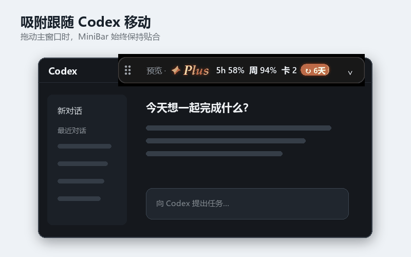
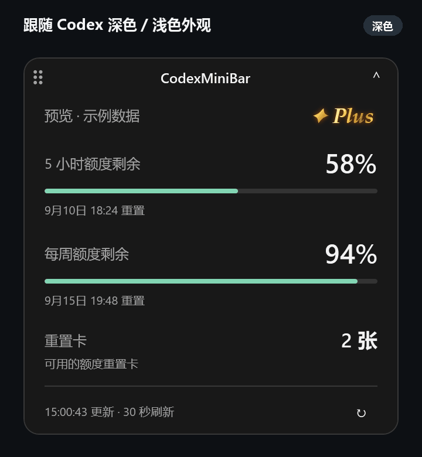
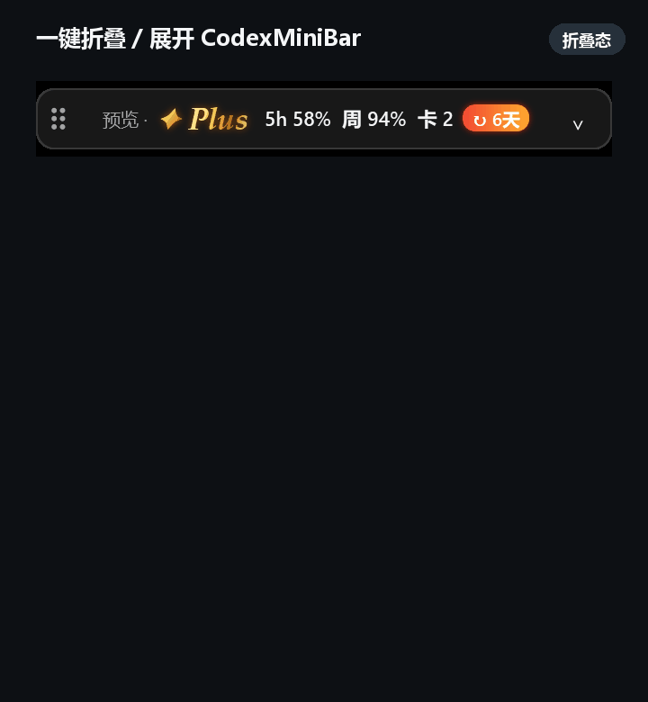
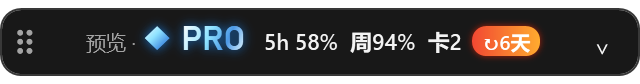
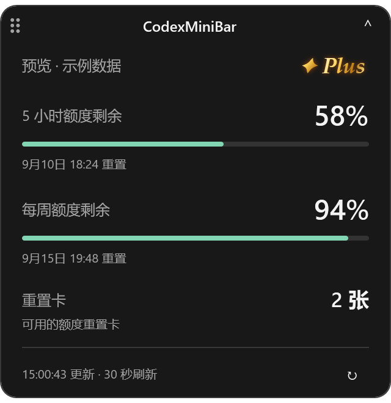
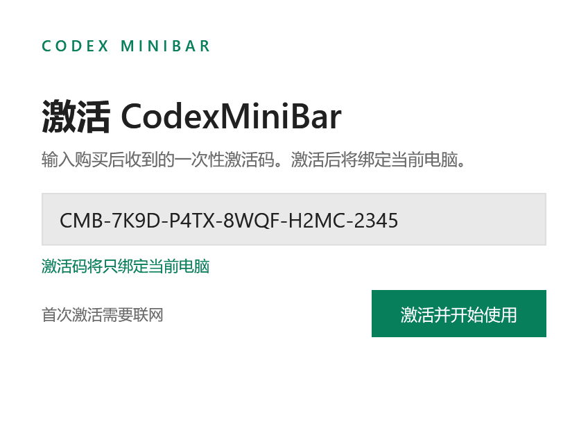

# CodexMiniBar

  <strong>English</strong> | <a href="README.zh-CN.md">简体中文</a>

**Keep your Codex quota in view, without interrupting your work.**

A lightweight Windows toolbar for Codex and VS Code that displays usage limits, reset timers, subscription status, and reset cards.

## Highlights

- Attaches to the top of the Codex or VS Code main window and follows movement, minimization, and DPI changes.
- The collapsed view provides account plan, five-hour quota, weekly quota, reset countdown, and reset-card information at a glance.
- The expanded view shows quota progress, reset times, subscription expiry, and the latest update time.
- Supports Simplified Chinese and English, and follows Codex dark, light, and custom themes.
- Stores attachment position and refresh interval separately for Codex and VS Code.
- Shows clear network-error guidance and automatically backs off refreshes.
- A native Windows WPF application with no extra Node.js or Python installation required.

## Feature demos

### Follows the Codex window

  

### Theme sync and collapse interaction

| Dark / light appearance | Collapse / expand |
|---|---|
|  |  |

## Product previews

### Collapsed view

| Plus | Pro |
|---|---|
|  |  |

### Expanded view

  

### Activation screen

  

> Screenshots use fixed sample data and contain no real account information.

## Purchase and activation

CodexMiniBar uses a one-device, one-code license:

1. You receive a unique activation code after purchase.
2. Activate online on first launch; the code is bound to the first computer.
3. Activated devices verify their license at launch; they can continue to work offline for up to 72 hours.
4. For a new computer or licensing issue, contact the seller through the original purchase channel.

To purchase, contact the seller through the CodexMiniBar Xiaohongshu product page. This showcase repository does not provide installers, source code, or seller tools.

## Privacy

CodexMiniBar reads quota information through a local, built-in Codex interface. It does not store Codex sign-in tokens, conversation content, or account email addresses. The licensing service receives only a product identifier, a hashed device identifier, and a random license ID.

## System requirements

- Windows 11 x64
- Codex desktop signed in, or a supported VS Code desktop installation as the attachment host
- Internet access for first-time activation

## Copyright

Copyright © 2026 JesseFei87. All rights reserved. Unauthorized copying, redistribution, modification, sale, or resale is prohibited.

CodexMiniBar is an independent third-party utility and is not affiliated with or endorsed by OpenAI or Microsoft. Product names and trademarks belong to their respective owners.
