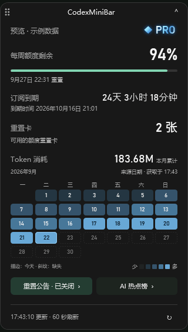
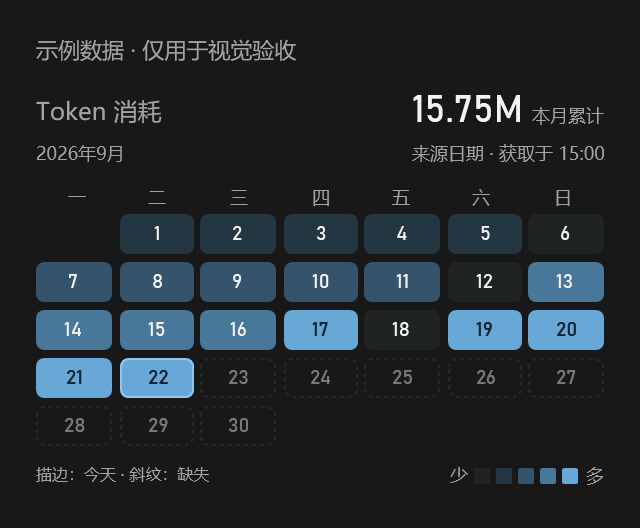
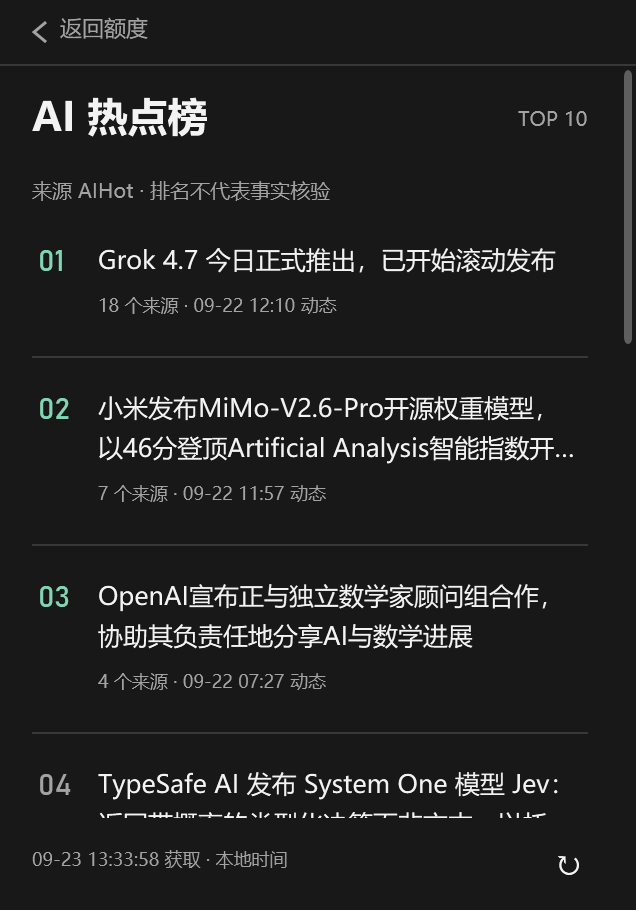
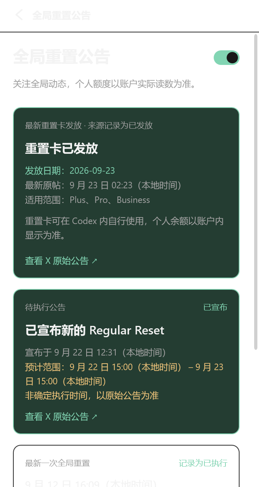
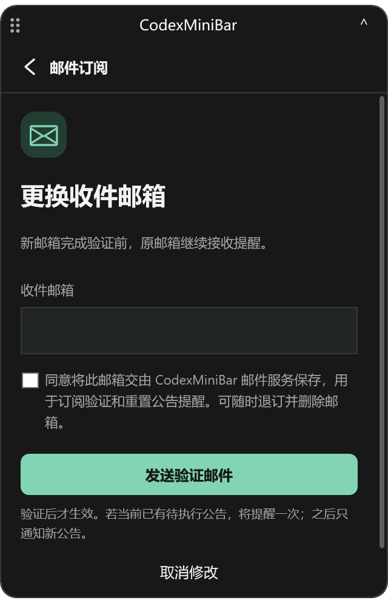
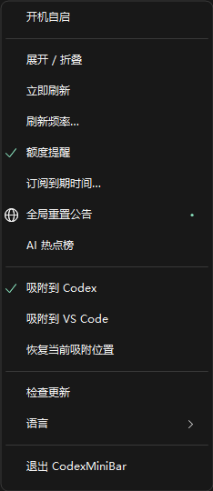
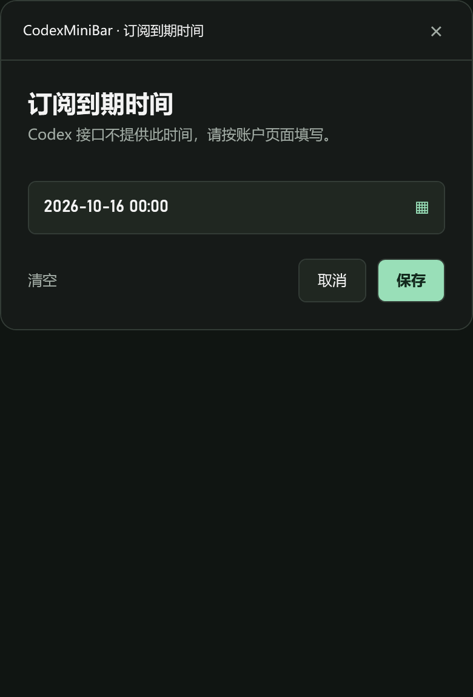

# CodexMiniBar

<strong>简体中文</strong> · <a href="README.en.md">English</a>

### 额度一眼可见，热点随手可查。

轻量 Windows 桌面工具栏，吸附在 Codex / VS Code 窗口上，把**额度、重置卡、Token 活动、重置公告与 AI 热点**收进同一块小面板。折叠时安静陪伴，展开时一屏看清。

**[下载 Windows x64 v1.3.3 完整免安装包](https://github.com/JesseFei87/CodexMiniBar-showcase/releases/download/v1.3.3/CodexMiniBar-Windows-x64-v1.3.3.zip)** · [更新说明](https://github.com/JesseFei87/CodexMiniBar-showcase/releases/latest) · [macOS 下载与差异](#下载与升级)

## 新界面：精致几何，一屏看全

居中的折叠信息、清晰的中文与数字层级、圆角卡片、克制的强调色。展开主页无需纵向滚动：额度、订阅、重置卡、Token 月历与功能入口同时可见；小屏幕和高缩放下自动适配可用空间。

> 新版 GIF 为程序原生界面截图组成的状态轮播，不是鼠标操作录像。额度、Token 和邮箱表单使用示例数据；热点与公告为历史公开快照，不代表当前实时消息。外观跟随 Codex 的深色、浅色及主题设置。

### Token 活动：本月消耗，看得到每一天

- 右侧显示当月累计，下方用整月热力日历展示每日活动。
- 悬停每日格子查看日期与具体 Token 数；颜色深浅区分使用量。
- 按接口来源日期统计，不擅自换算日桶；今天描边、未来日期弱化，缺失数据使用斜纹，不伪装为零。

## 新功能：不离开面板，也能看全局

### AI 热点榜：榜单 → 详情 → 来源

从主页或托盘进入，在同一面板查看排名、标题、来源数量和动态时间。点击查看详情，**来源默认折叠**，返回保留榜单滚动位置；聚合报道和原始链接在系统浏览器打开。

按需加载、独立手动刷新；失败时保留已有缓存并提示状态。热点不发送邮件、不轮播打扰，也不挤占折叠栏。

### 全局重置公告：区分预告、发卡与直接重置

- 展示待执行公告、最近一次确认的直接重置，以及最新的**重置卡已发放**记录。
- 新发卡进展优先于旧预告，显示来源发放日期、最新原帖时间和适用范围。
- 支持未读标记、手动刷新、缓存提示、原始 X 链接，以及返回额度主页。
- 不把“发放重置卡”误报为“个人额度已自动恢复”。余额及到账情况以 Codex 账户为准。

### 可选邮件订阅

在公告页填写邮箱并确认订阅，可接收云端的新公告提醒，**不需要保持电脑开机**。支持验证状态、暂停 / 恢复提醒、更换邮箱、测试邮件和退订入口。

查看邮件订阅表单

> 桌面公告与云端订阅独立；关闭桌面公告不会自动退订邮件。发信依赖云端服务，桌面显示“重置卡已发放”不等于一定触发一封邮件。

## 新托盘：与主面板一致的深浅外观

圆角、分组分隔线、清晰的选中状态与未读提示，深色 / 浅色跟随 Codex。常用操作集中在这里。

| 分组 | 托盘操作 |
| --- | --- |
| 启动与查看 | 开机自启、展开 / 折叠 |
| 额度与订阅 | 立即刷新、刷新频率、额度提醒、订阅到期时间 |
| 信息入口 | 全局重置公告、AI 热点榜 |
| 窗口吸附 | 吸附到 Codex、吸附到 VS Code、恢复当前吸附位置 |
| 维护与外观 | 检查更新、简体中文 / English、退出程序 |

### 订阅到期时间：用日历选，精确到分钟

点击日期框展开月历，切换月份、选择日期，再设置小时和分钟；支持清空、取消与保存。到期时间由用户填写，**不是 Codex 接口自动提供**，按本地时区计算倒计时。

## 完整功能一览（Windows v1.3.3）

| 能力 | 已实现功能 |
| --- | --- |
| 窗口吸附 | Codex / VS Code 宿主切换；跟随移动、最小化和 DPI 变化；拖动调整位置；分别记忆宿主吸附位置；恢复位置 |
| 额度查看 | 账户等级、适用账户的 5 小时额度、每周额度、进度条、重置时间及倒计时、更新时间 |
| 额度提醒 | 可开关的额度提醒，点击提醒返回对应额度区域 |
| 重置卡 | 可用张数、来源提供时的最近到期时间 |
| 订阅到期 | 分钟级日期控件、到期倒计时、保存 / 清空手动日期 |
| Token 活动 | 当月累计、逐日热力日历、每日悬停明细、来源日期口径、无数据 / 缺失状态 |
| 重置公告 | 开关、未读状态、待执行预告、已确认直接重置、重置卡发放、来源链接、历史保留与缓存提示 |
| AI 热点 | 按需榜单、详情、折叠来源、原文 / 聚合链接、返回位置保留、独立刷新与缓存提示 |
| 邮件订阅 | 可选云端订阅、邮箱确认、提醒暂停 / 恢复、更换邮箱、测试邮件、退订 |
| 外观与语言 | 精致几何排版、居中折叠信息、主页一屏适配、主题跟随、统一托盘、新版应用与托盘图标、中英切换 |
| 日常使用 | 自定义刷新间隔（10–1800 秒）、手动刷新、网络异常自动放慢重试 |
| 安装与更新 | 免安装、首次启动创建桌面快捷方式、可选开机自启、检查更新提示、用户选择升级、升级后重启并保留配置 |

### 窗口跟随演示

> 此段为早期版本的真实吸附演示，仅展示跟随行为；新版视觉以上方截图为准。仅 Windows 支持窗口吸附。

## 下载与升级

| 平台 | 下载 | 说明 |
| --- | --- | --- |
| Windows x64 v1.3.3 | [完整免安装 ZIP](https://github.com/JesseFei87/CodexMiniBar-showcase/releases/download/v1.3.3/CodexMiniBar-Windows-x64-v1.3.3.zip) · [SHA-256](https://github.com/JesseFei87/CodexMiniBar-showcase/releases/download/v1.3.3/SHA256SUMS.txt) | 本页新版界面与功能适用版本 |
| macOS Apple Silicon v1.1.0 | [DMG 安装包](https://github.com/JesseFei87/CodexMiniBar-showcase/raw/refs/heads/main/downloads/CodexMiniBar-macOS-Apple-Silicon.dmg) · [SHA-256](downloads/CodexMiniBar-macOS-Apple-Silicon.dmg.sha256) | 保持原版；不支持窗口吸附，未同步以上全部 Windows 新功能 |

**首次使用 Windows：** 下载完整包 → 解压全部文件 → 保留 `CodexMiniBar.exe.config` 与 EXE 同目录 → 运行 `CodexMiniBar.exe`。不需要安装 Node.js 或 Python。

**已有检查更新功能：** 托盘 → 检查更新 → 自主选择是否升级。成功后自动重启，保留原配置和用户设置。

**v1.1 / v1.2 用户：** 先退出旧版，再手动下载并完整解压新版。若更换目录，请检查已有快捷方式与开机自启指向。

固定名 `CodexMiniBar-Windows-x64-portable.zip` 是内置更新器专用包，**首次使用请下载上表完整包**。macOS 打开 DMG 后拖入 Applications。

## 系统要求与数据说明

- Windows 11 x64 / .NET Framework 4.8；已安装并登录 Codex 桌面版。VS Code 可作为吸附宿主，不替代 Codex 登录。
- macOS 13 或更高版本，Apple Silicon（M1 或更新）；平台功能以对应版本为准。
- 额度与 Token 取决于账户及官方接口的实际返回；缺失信息不会凭空补齐。
- 重置公告与热点来自第三方 AIHot，不是 OpenAI 官方公告服务；标题及状态以来源为准。
- 只读获取额度与 Token 信息，不读取会话正文。Token 备用读取只在本机内存中使用已有登录凭据访问官方 Profile 接口，不保存凭据或发送给第三方。
- 主动订阅邮件时，填写的邮箱会提交给订阅服务，可随时退订。桌面工具与云端邮件服务的可用性分别判断。

## Copyright

Copyright © 2026 JesseFei87. All rights reserved. Unauthorized copying, redistribution, modification, sale, or resale is prohibited.

CodexMiniBar is an independent third-party utility and is not affiliated with or endorsed by OpenAI or Microsoft. Product names and trademarks belong to their respective owners.
